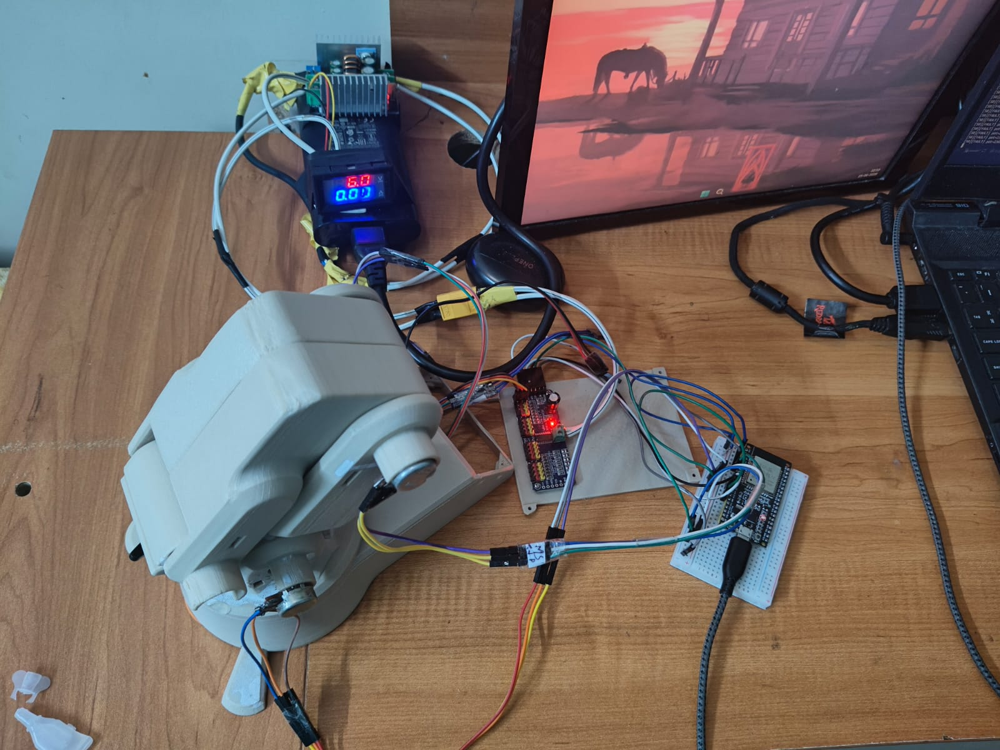
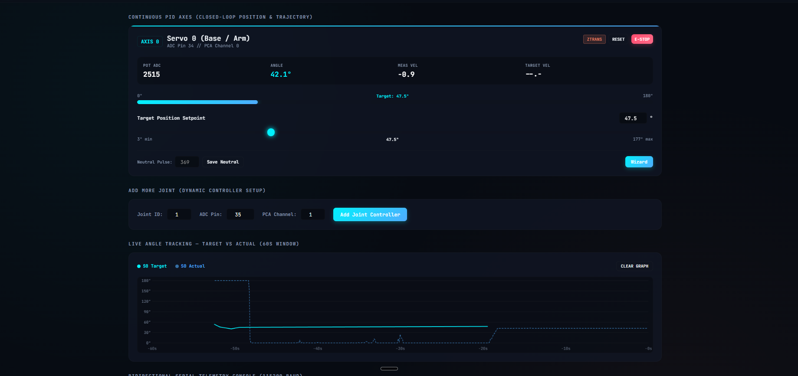
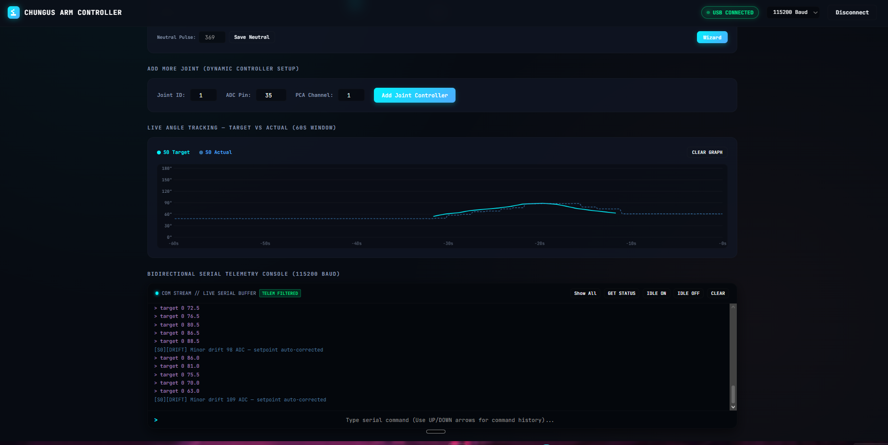

# Chungus Arm V1 🦾

Hello! This is my project, the **Chungus Arm V1**. 

It's meant to be a cheap educational robotic arm to help students, university folk, and curious hobbyists learn how you can build a true closed-loop control arm using simple potentiometers—all for as low as ₹2000 (around $25 USD). 

Most robotics tutorials online either tell you to use basic hobby servos that jitter and have zero torque feedback, or they jump straight into smart servos like Dynamixels that cost hundreds of dollars per joint. That didn't sit right with me. You shouldn't need massive budgets to learn real control theory. With good firmware and some patience, you can make budget hardware perform remarkably well.

---

## How It Works (No Absolute Servos Needed!)

The core idea behind Chungus Arm is complete mechanical flexibility. We don't use expensive pre-packaged absolute servos here. Instead, the controller works with **any standard continuous rotation servo or geared DC motor**, pairing it directly with an external analog potentiometer attached to the joint pivot. 



This setup allows you to attain complete flexibility over your gear designs, arm lengths, and torque specs. By constantly reading the joint angles through an ESP32 ADC and driving a PCA9685 PWM board, we run our own custom PID control loops right on the microcontroller. The firmware handles custom trapezoidal velocity profiles, deadband braking, integral anti-windup clamping, and even automatic gravity compensation!

---

## The Web Serial Dashboard

Trying to tune PID gains through a scrolling terminal prompt is agonizing. So, I built a custom **Web Serial Dashboard** contained completely inside a single HTML file (`ui/index.html`).

There are no backend servers to configure, no npm packages to install, and no weird drivers needed. You just open the web page in Chrome or Edge, click **Connect USB Arm**, and the browser talks bi-directionally with the ESP32 over serial at 115200 baud.



The dashboard gives you live position sliders, velocity indicators, and instant E-stop controls. We also added an automated **Wizard** right on the joint cards. It guides you through finding your exact neutral motor stop pulses and mapping the 0° to 180° potentiometer ADC boundaries without ever having to recompile C++ code.



To help you actually see what your control loops are doing, there is a built-in **Live Target vs Actual Angle Graph**. You can watch your step response in real time, observe how the arm decelerates through the transition zone (`[ZTRANS]`), and verify that it locks solidly into the hold deadband (`[HOLD]`) down to fractions of a degree. If you add more physical linkages later on, you can just use the dynamic **Add More Joint** panel at the bottom of the page to spin up new controller interfaces on the fly.

---

## Hardware Bill of Materials (~₹2000)

* **Microcontroller:** ESP32 Development Board
* **PWM Driver:** Adafruit PCA9685 16-Channel 12-bit PWM Driver
* **Actuators:** Standard continuous rotation servos (like modified MG995/MG996R) or simple geared DC motors
* **Feedback:** Standard 10k Rotary Potentiometers linked to the joint pivots
* **Power:** 5V 3A+ power supply

---

## Getting Started

### 1. Flash the Firmware
We use PlatformIO for embedded build management. Plug in your ESP32 via USB and run:
```bash
pio run --target upload
```

### 2. Open the Control Center
Open `ui/index.html` inside Google Chrome or Microsoft Edge (any Chromium browser with Web Serial API support).

### 3. Connect & Move
1. Click **Connect USB Arm** in the top right and select your ESP32 COM port.
2. Click the **Wizard** button on your joint card to run auto-calibration if it's a new setup.
3. Drag the target slider or type commands like `target 0 90` into the live terminal buffer to watch the arm move!

---

## Serial Commands

If you like automating tests with Python scripts or terminal prompts, the firmware accepts clean, human-readable commands over serial:

* `target <id> <angle>` — Command joint to a specific angle (3.0° to 177.0°)
* `stop <id>` — Emergency stop PID output and hold neutral
* `reset <id>` — Clear fault conditions and resume normal operation
* `savestop <id> <pulse>` — Save exact neutral idle pulse to NVS memory
* `status` — Print active settings and diagnostics for all axes

---
*Built to make experimental robotics accessible to everyone.*
